# BUSINESS PLAN
# Visit Sulsel - Super App Pariwisata Sulawesi Selatan

**Dokumen Proposal untuk Dinas Pariwisata Provinsi Sulawesi Selatan**

*Versi 1.0 | Januari 2026*

---

## Daftar Isi

1. [Executive Summary](#1-executive-summary)
2. [Strategi Pendekatan Awal](#2-strategi-pendekatan-awal)
3. [Latar Belakang dan Permasalahan](#3-latar-belakang-dan-permasalahan)
4. [Solusi: Platform Visit Sulsel](#4-solusi-platform-visit-sulsel)
5. [Model Bisnis dan Revenue Streams](#5-model-bisnis-dan-revenue-streams)
6. [Status Pengembangan Platform](#6-status-pengembangan-platform)
7. [Proyeksi Dampak Ekonomi](#7-proyeksi-dampak-ekonomi)
8. [Strategi Pertumbuhan ala Startup Sukses](#8-strategi-pertumbuhan-ala-startup-sukses)
9. [Roadmap Pengembangan](#9-roadmap-pengembangan)
10. [Kebutuhan Investasi dan Pendanaan](#10-kebutuhan-investasi-dan-pendanaan)
11. [Tim dan Kebutuhan SDM](#11-tim-dan-kebutuhan-sdm)
12. [Analisis Risiko dan Mitigasi](#12-analisis-risiko-dan-mitigasi)
13. [Lampiran](#13-lampiran)

> **Dokumen Pendukung:** Lihat juga [DIAGRAMS.md](./DIAGRAMS.md) untuk diagram visual (Mermaid) yang dapat digunakan untuk presentasi.

---

## 1. Executive Summary

### Tentang Visit Sulsel

**Visit Sulsel** adalah platform super-app pariwisata digital yang dirancang khusus untuk Provinsi Sulawesi Selatan. Platform ini mengintegrasikan seluruh ekosistem pariwisata dalam satu aplikasi: mulai dari eksplorasi destinasi, pemesanan akomodasi, marketplace UMKM lokal, hingga koneksi dengan kreator konten dan pemandu wisata profesional.

### Visi
> "Menjadi platform pariwisata digital terdepan di Indonesia Timur yang memberdayakan ekonomi lokal dan melestarikan kekayaan budaya Sulawesi Selatan."

### Misi
1. Mempermudah wisatawan dalam merencanakan dan menikmati perjalanan di Sulawesi Selatan
2. Memberdayakan UMKM lokal melalui akses pasar digital yang lebih luas
3. Menciptakan lapangan kerja baru di sektor pariwisata dan ekonomi kreatif
4. Melestarikan dan mempromosikan kekayaan budaya 4 suku besar Sulsel

### Unique Value Proposition

| Aspek | Keunggulan Visit Sulsel |
|-------|------------------------|
| **All-in-One** | Satu platform untuk semua kebutuhan wisata (booking, belanja, guide, kreator) |
| **Lokal First** | Fokus pada pemberdayaan pelaku wisata dan UMKM lokal |
| **Budaya** | Konten mendalam tentang 4 suku: Bugis, Makassar, Toraja, Mandar |
| **Komunitas** | Forum diskusi, review autentik, dan fitur cari teman perjalanan |
| **Dampak Terukur** | Dashboard transparan untuk mengukur dampak ekonomi |

### Target Market

**Primary:**
- Wisatawan domestik usia 25-45 tahun
- Backpacker dan solo traveler
- Keluarga yang merencanakan liburan

**Secondary:**
- Wisatawan mancanegara (terutama dari Asia Tenggara, Eropa, Australia)
- Corporate/MICE tourism
- Educational tourism

### Proyeksi Dampak (3 Tahun)

| Metrik | Target |
|--------|--------|
| Wisatawan Terlayani | 1.2 Juta+ |
| UMKM Diberdayakan | 500+ |
| Lapangan Kerja Baru | 200+ |
| Nilai Transaksi | Rp 25 Miliar |
| Kontribusi PAD | Rp 2.5 Miliar |

---

## 2. Strategi Pendekatan Awal

### Langkah Pertama: Surat Resmi ke Gubernur Sulawesi Selatan

Sebelum implementasi lebih lanjut, langkah strategis pertama adalah **menyampaikan proposal resmi kepada Gubernur Sulawesi Selatan** melalui surat resmi yang berisi:

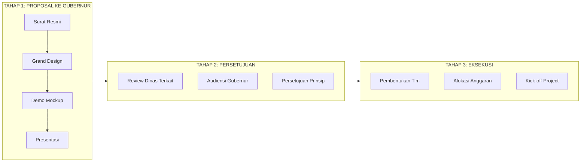

### Komponen Proposal ke Gubernur

#### A. Surat Pengantar Resmi
- Latar belakang dan urgensi platform pariwisata digital
- Potensi dampak ekonomi untuk Sulawesi Selatan
- Permohonan audiensi dan dukungan

#### B. Dokumen Grand Design
- Konsep lengkap Visit Sulsel sebagai Super App Pariwisata
- Model bisnis dan proyeksi revenue
- Roadmap pengembangan 3 tahun
- Kebutuhan investasi dan SDM

#### C. Demo Mockup Platform
- **Prototype interaktif** yang menunjukkan user experience
- Demonstrasi fitur-fitur utama:
  - Homepage dan navigasi
  - Katalog destinasi wisata
  - Marketplace UMKM
  - Booking guide dan kreator
  - Komunitas dan review
- Video walkthrough platform (3-5 menit)

#### D. Materi Presentasi
- Slide deck eksekutif (15-20 slide)
- Infografis dampak ekonomi
- Benchmark dengan platform serupa yang sukses

### Timeline Pendekatan Awal

| Tahap | Aktivitas | Target Waktu |
|-------|-----------|--------------|
| 1 | Finalisasi dokumen grand design | Minggu 1-2 |
| 2 | Pengembangan demo mockup interaktif | Minggu 2-4 |
| 3 | Penyusunan surat resmi ke Gubernur | Minggu 4 |
| 4 | Pengiriman proposal | Minggu 5 |
| 5 | Follow-up dan audiensi | Minggu 6-8 |
| 6 | Presentasi ke Gubernur/Dinas | Minggu 8-10 |

### Persiapan Demo Mockup

Demo mockup harus **impressive dan profesional** untuk meyakinkan stakeholder:

| Komponen | Deskripsi | Status |
|----------|-----------|--------|
| UI/UX Design | Desain modern, responsif, branding Sulsel | ✅ Selesai |
| Frontend App | Next.js dengan animasi smooth | ✅ Selesai |
| Data Dummy | Destinasi, UMKM, Guide terpopulasi | ✅ Selesai |
| Hosting Demo | Deploy ke domain visitsulsel.com | 🔄 Proses |
| Video Demo | Recording walkthrough platform | 📋 Planned |

### Tips Presentasi ke Gubernur

1. **Fokus pada Dampak Ekonomi** - Gubernur dan pejabat akan tertarik pada angka: lapangan kerja, PAD, pemberdayaan UMKM
2. **Tunjukkan Urgensi** - Kompetisi dengan daerah lain yang sudah memiliki platform digital
3. **Benchmark Sukses** - Referensi keberhasilan Gojek, Aruna, dan startup berdampak lainnya
4. **Visual yang Kuat** - Demo langsung lebih meyakinkan daripada slide

---

## 3. Latar Belakang dan Permasalahan

### Kondisi Pariwisata Sulawesi Selatan

Sulawesi Selatan memiliki potensi pariwisata yang luar biasa:

- **Tana Toraja** - Destinasi wisata budaya kelas dunia
- **Pantai Losari** - Ikon kota Makassar
- **Rammang-Rammang** - Kawasan karst terbesar kedua di dunia
- **Pantai Bira** - Pantai pasir putih dengan pembuatan perahu Pinisi
- **Bantimurung** - Kerajaan kupu-kupu dengan air terjun indah

**Data Pariwisata Sulsel (2024-2025):**
- Jumlah wisatawan: ~4 juta/tahun
- Kontribusi terhadap PDRB: ~8%
- Jumlah UMKM sektor pariwisata: ~15.000

### Permasalahan yang Dihadapi

#### A. Fragmentasi Informasi Wisata
- Informasi destinasi tersebar di berbagai sumber
- Tidak ada platform terpadu untuk perencanaan perjalanan
- Wisatawan kesulitan menemukan hidden gems

#### B. Keterbatasan Akses Digital UMKM
- Hanya ~20% UMKM lokal memiliki presence digital
- Produk khas Sulsel sulit diakses wisatawan secara online
- Potensi penjualan tidak maksimal

#### C. Tantangan Pelaku Wisata Lokal
- Tour guide lokal sulit mendapat klien
- Fotografer dan kreator konten belum terkoneksi dengan wisatawan
- Tidak ada platform yang mempertemukan supply dan demand

#### D. Minimnya Data untuk Pengambilan Keputusan
- Tidak ada data real-time tentang pergerakan wisatawan
- Sulit mengukur dampak ekonomi pariwisata
- Perencanaan kebijakan berbasis asumsi

### Gap Digitalisasi

**Kondisi Saat Ini vs Solusi Visit Sulsel:**

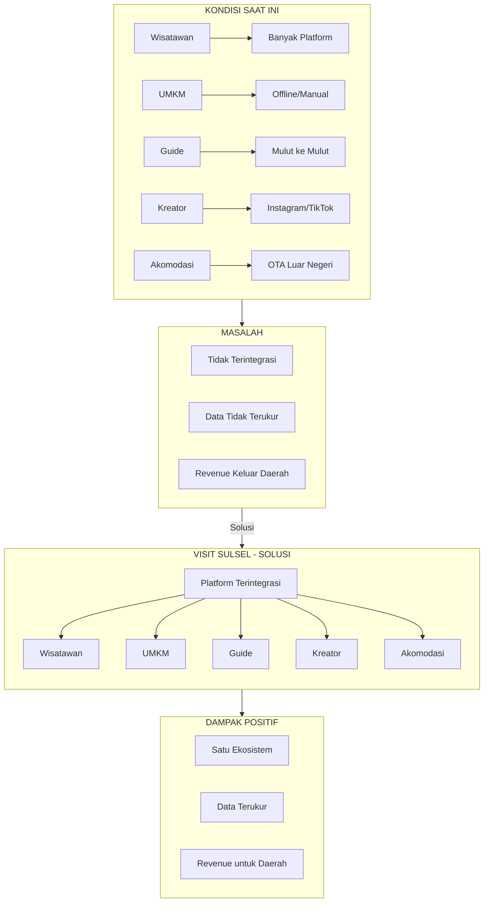

---

## 4. Solusi: Platform Visit Sulsel

### Konsep Super App

Visit Sulsel mengadopsi konsep **Super App** - satu aplikasi yang menyediakan berbagai layanan terintegrasi. Konsep ini sudah terbukti sukses di Asia Tenggara (Grab, Gojek) dan kini diaplikasikan khusus untuk sektor pariwisata.

### 5 Pilar Layanan Utama

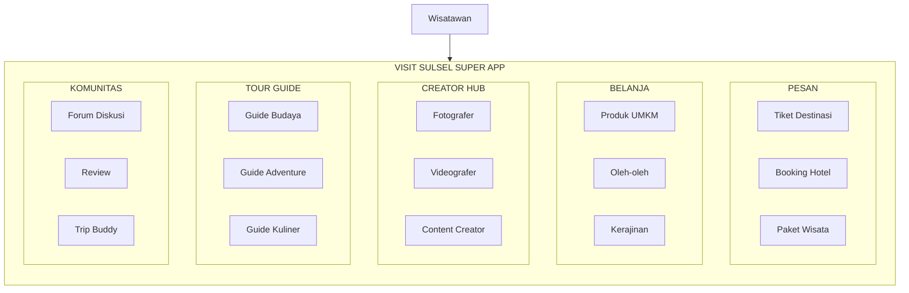

#### PILAR 1: Pesan (Booking Platform)

**Fitur:**
- Pemesanan tiket masuk destinasi wisata
- Booking akomodasi (hotel, resort, homestay)
- Paket wisata terintegrasi
- Reservasi transportasi lokal

**Nilai Tambah:**
- Harga transparan dan kompetitif
- Konfirmasi instan
- Dukungan pembayaran digital

---

#### 🛒 PILAR 2: Belanja (UMKM Marketplace)

**Kategori Produk:**

| Kategori | Contoh Produk | Potensi UMKM |
|----------|--------------|--------------|
| **Tenun & Kain** | Sarung Sutra Sengkang, Lipa Sabbe | 50+ pengrajin |
| **Kuliner** | Kopi Toraja, Barongko, Abon Tuna | 100+ produsen |
| **Kerajinan** | Ukiran Toraja, Anyaman Lontar | 40+ pengrajin |
| **Aksesoris** | Songkok Recca, Badik Display | 30+ pengrajin |

**Fitur Marketplace:**
- Profil toko dengan verifikasi
- Rating dan review produk
- Sistem pembayaran aman
- Pengiriman terintegrasi
- Dashboard penjualan untuk UMKM

---

#### 📸 PILAR 3: Creator Hub

**Layanan Kreator:**
- Fotografer profesional
- Videografer dan drone pilot
- Content creator
- Travel writer

**Fitur:**
| Fitur | Deskripsi |
|-------|-----------|
| Portfolio | Showcase karya kreator |
| Booking | Pemesanan jasa langsung |
| Review | Rating dari klien sebelumnya |
| Challenge | Kompetisi konten berhadiah |

**Data Kreator Terdaftar:**
- 156 kreator aktif
- 1,247 job selesai
- Rating rata-rata: 4.7/5
- Total pendapatan kreator: Rp 890 juta

---

#### 🧭 PILAR 4: Tour Guide

**Kategori Guide:**

| Spesialisasi | Area | Jumlah Guide |
|-------------|------|--------------|
| Budaya & Sejarah | Toraja, Makassar | 45 |
| Alam & Adventure | Maros, Malino | 35 |
| Wisata Kuliner | Makassar | 25 |
| Bahari & Diving | Bira, Spermonde | 18 |
| Photography Tour | Semua area | 15 |

**Fitur Guide:**
- Profil lengkap dengan sertifikasi
- Harga layanan transparan
- Ketersediaan real-time
- Booking dan pembayaran online
- Review dan rating

**Statistik:**
- 138 guide terdaftar
- 112 guide terverifikasi
- 4,567 tur selesai
- Rating rata-rata: 4.8/5

---

#### 💬 PILAR 5: Komunitas

**Fitur Komunitas:**

1. **Forum Diskusi**
   - Tips perjalanan
   - Rekomendasi kuliner
   - Pengalaman wisata
   - Itinerary sharing

2. **Review Autentik**
   - Review destinasi dari pengunjung asli
   - Foto dan video dari wisatawan
   - Rating terverifikasi

3. **Trip Buddy**
   - Cari teman perjalanan
   - Sharing cost untuk trip
   - Komunitas berdasarkan minat

**Statistik Komunitas:**
- 12,456 member
- 3,456 diskusi aktif
- 8,934 review
- 234 user aktif per hari

---

### Fitur Pendukung

#### Peta Interaktif
- Lokasi semua destinasi
- Navigasi terintegrasi
- Informasi real-time

#### Itinerary Builder
- Paket wisata siap pakai (1-7 hari)
- Custom itinerary builder
- Estimasi budget otomatis

#### Wishlist
- Simpan destinasi favorit
- Notifikasi promo

#### Multi-bahasa
- Bahasa Indonesia
- English
- 日本語 (coming soon)

---

## 5. Model Bisnis dan Revenue Streams

### Opsi Bentuk Badan Usaha

> **CATATAN:** Bentuk badan usaha perlu dibahas lebih lanjut dalam meeting dengan stakeholder.

#### Perbandingan Opsi Badan Usaha

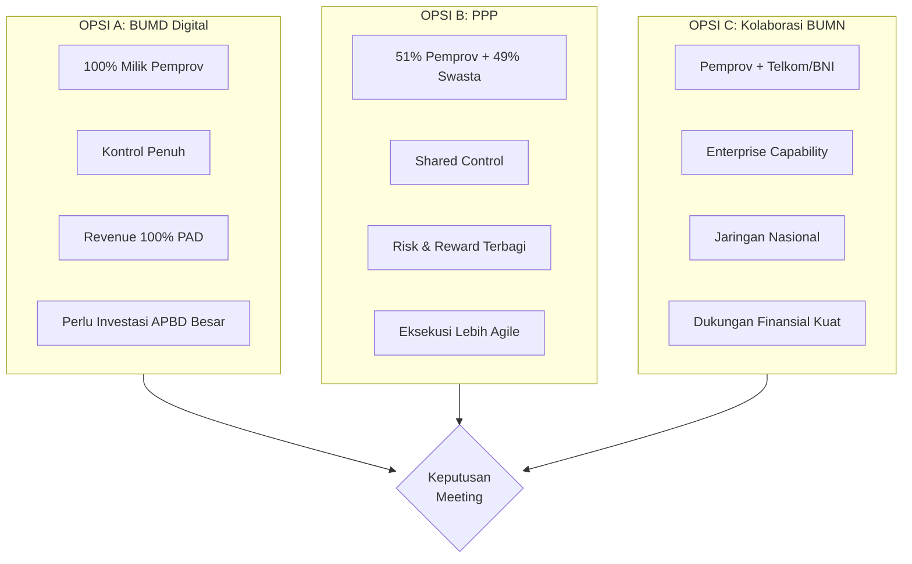

#### Opsi A: BUMD Digital (100% Milik Pemprov)

**Kelebihan:**
- Kontrol penuh oleh pemerintah
- Revenue 100% untuk daerah
- Alignment dengan kebijakan pariwisata

**Tantangan:**
- Perlu investasi besar dari APBD
- Birokrasi pengambilan keputusan
- Perlu rekrut talenta tech profesional

---

#### Opsi B: Public-Private Partnership (PPP)

**Kelebihan:**
- Kombinasi kapabilitas pemerintah dan swasta
- Investasi dan risiko terbagi
- Eksekusi lebih agile

**Tantangan:**
- Perlu kerangka hukum yang jelas
- Alignment kepentingan
- Pembagian revenue

---

#### Opsi C: Kolaborasi dengan BUMN

**Potensi Partner:**
- **Telkom Indonesia** - Infrastruktur digital
- **Bank BNI/BRI** - Payment gateway
- **Garuda Indonesia** - Paket wisata

**Kelebihan:**
- Kapabilitas enterprise
- Jaringan nasional
- Dukungan finansial kuat

---

### Revenue Streams

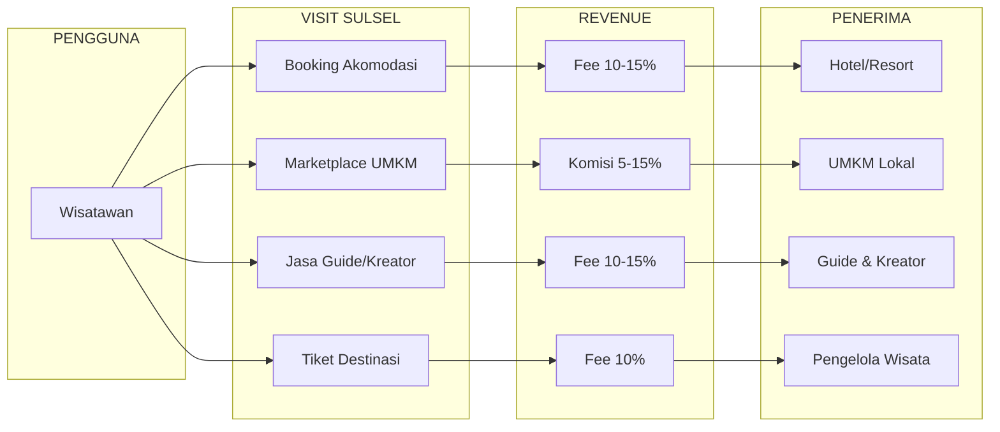

#### 1. Komisi Transaksi Marketplace (5-15%)

| Kategori | Rate Komisi | Proyeksi/Tahun |
|----------|-------------|----------------|
| Produk UMKM | 10% | Rp 500 juta |
| Kuliner & Oleh-oleh | 8% | Rp 300 juta |
| Kerajinan Premium | 12% | Rp 200 juta |

#### 2. Fee Booking (10-15%)

| Layanan | Rate Fee | Proyeksi/Tahun |
|---------|----------|----------------|
| Akomodasi | 15% | Rp 1.5 miliar |
| Tiket Wisata | 10% | Rp 400 juta |
| Paket Wisata | 12% | Rp 600 juta |

#### 3. Fee Jasa Kreator & Guide (10-15%)

| Layanan | Rate Fee | Proyeksi/Tahun |
|---------|----------|----------------|
| Tour Guide | 10% | Rp 300 juta |
| Fotografer | 12% | Rp 200 juta |
| Videografer | 12% | Rp 150 juta |

#### 4. Pendapatan Lainnya

| Sumber | Proyeksi/Tahun |
|--------|----------------|
| Iklan & Promosi | Rp 200 juta |
| Featured Listing | Rp 150 juta |
| Data Analytics | Rp 100 juta |

#### Total Proyeksi Revenue Tahun 1-3

| Tahun | Target Revenue | Pertumbuhan |
|-------|---------------|-------------|
| 2026 | Rp 2.5 Miliar | - |
| 2027 | Rp 5.0 Miliar | 100% |
| 2028 | Rp 8.5 Miliar | 70% |

---

## 6. Status Pengembangan Platform

### Progress Development

Platform Visit Sulsel telah dikembangkan dengan tech stack modern:

| Komponen | Teknologi | Status |
|----------|-----------|--------|
| Frontend | Next.js 16, React 19 | ✅ Selesai |
| Styling | Tailwind CSS v4 | ✅ Selesai |
| Animasi | Framer Motion | ✅ Selesai |
| Maps | Leaflet | ✅ Selesai |
| Deployment | Docker Ready | ✅ Selesai |
| Backend API | - | 🔄 Dalam perencanaan |
| Payment | - | 🔄 Dalam perencanaan |
| Mobile App | - | 📋 Roadmap |

### Data yang Sudah Terintegrasi

| Data | Jumlah | Status |
|------|--------|--------|
| Destinasi Wisata | 8 lokasi | ✅ |
| Produk UMKM | 10 produk | ✅ |
| Kreator | 6 profil | ✅ |
| Tour Guide | 6 profil | ✅ |
| Akomodasi | 8 properti | ✅ |
| Event | 6 event | ✅ |
| Itinerary | 4 paket | ✅ |
| Kuliner | 8 menu | ✅ |
| Budaya | 6 artikel | ✅ |

### Destinasi Terdaftar

| Destinasi | Lokasi | Kategori | Rating |
|-----------|--------|----------|--------|
| Tana Toraja | Kab. Toraja | Budaya | 4.8 |
| Pantai Losari | Makassar | Pantai | 4.6 |
| Bantimurung | Maros | Alam | 4.5 |
| Rammang-Rammang | Maros | Alam | 4.6 |
| Pantai Bira | Bulukumba | Pantai | 4.7 |
| Malino Highland | Gowa | Alam | 4.4 |
| Fort Rotterdam | Makassar | Budaya | 4.5 |
| Pulau Samalona | Spermonde | Pantai | 4.7 |

### Budaya yang Didokumentasikan

Platform mencakup informasi mendalam tentang **4 suku besar** Sulawesi Selatan:

| Suku | Wilayah | Populasi | Tradisi Utama |
|------|---------|----------|---------------|
| **Bugis** | Bone, Wajo, Soppeng | ±6.5 juta | Mappacci, Tudang Sipulung |
| **Makassar** | Gowa, Takalar | ±2.5 juta | Accera Kalompoang, Pa'karena |
| **Toraja** | Tana Toraja | ±1.2 juta | Rambu Solo', Ma'nene |
| **Mandar** | Majene, Mamuju | ±500 ribu | Sayyang Pattu'du |

---

## 7. Proyeksi Dampak Ekonomi

### Dampak Langsung

#### A. Pemberdayaan UMKM

| Metrik | Tahun 1 | Tahun 2 | Tahun 3 |
|--------|---------|---------|---------|
| UMKM Terdaftar | 234 | 400 | 600 |
| Transaksi/Bulan | 500 | 1,500 | 4,000 |
| GMV | Rp 5M | Rp 15M | Rp 35M |
| Rata-rata Pendapatan UMKM/Bulan | Rp 2.5 juta | Rp 4 juta | Rp 6 juta |

#### B. Penciptaan Lapangan Kerja

| Kategori | Tahun 1 | Tahun 2 | Tahun 3 |
|----------|---------|---------|---------|
| Tour Guide Aktif | 50 | 100 | 150 |
| Kreator Aktif | 75 | 150 | 250 |
| Tim Operasional | 15 | 30 | 50 |
| **Total** | **140** | **280** | **450** |

#### C. Kontribusi PAD

| Sumber | Tahun 1 | Tahun 2 | Tahun 3 |
|--------|---------|---------|---------|
| Pajak Transaksi | Rp 250 juta | Rp 500 juta | Rp 850 juta |
| Dividen BUMD | Rp 300 juta | Rp 750 juta | Rp 1.2 miliar |
| **Total PAD** | **Rp 550 juta** | **Rp 1.25 miliar** | **Rp 2.05 miliar** |

### Distribusi Dampak Ekonomi

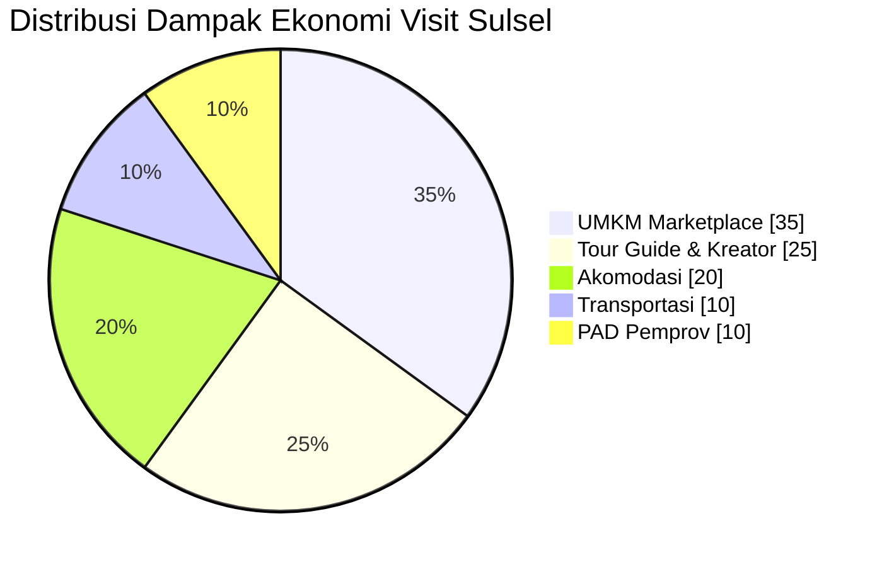

### Dampak Tidak Langsung

1. **Multiplier Effect**
   - Setiap Rp 1 transaksi di Visit Sulsel menghasilkan Rp 2.5 perputaran ekonomi lokal

2. **Peningkatan Kunjungan Wisata**
   - Target peningkatan 15% kunjungan wisata melalui promosi digital

3. **Pelestarian Budaya**
   - Dokumentasi dan promosi 4 suku besar
   - Pelestarian kerajinan tradisional melalui marketplace

4. **Pengembangan SDM**
   - Pelatihan digital untuk UMKM
   - Sertifikasi tour guide
   - Workshop untuk kreator konten

---

## 8. Strategi Pertumbuhan ala Startup Sukses

### Belajar dari Gojek, Aruna, dan Startup Berdampak Indonesia

Visit Sulsel dapat meniru model pertumbuhan startup Indonesia yang telah terbukti sukses menciptakan dampak nyata:

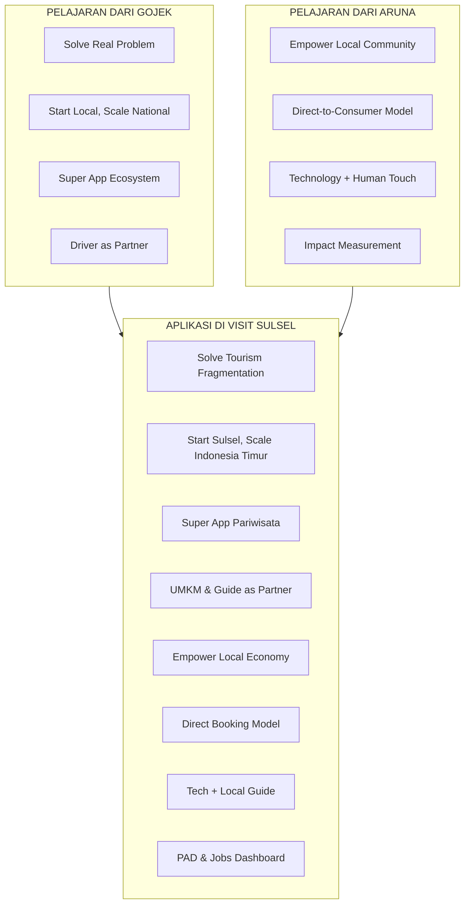

### Model Pertumbuhan yang Diadopsi

#### 1. Dari Gojek: Super App & Ecosystem Thinking

| Strategi Gojek | Aplikasi di Visit Sulsel |
|----------------|--------------------------|
| Mulai dari 1 layanan (ojek) lalu expand | Mulai dari destinasi → expand ke marketplace, guide, kreator |
| Driver sebagai mitra, bukan karyawan | UMKM & Guide sebagai mitra dengan revenue sharing |
| Solve everyday problem | Solve tourism planning problem |
| Subsidi awal untuk akuisisi user | Promo dan diskon untuk early adopters |
| Data-driven decision | Dashboard analytics untuk optimasi |

#### 2. Dari Aruna: Pemberdayaan Komunitas Lokal

| Strategi Aruna | Aplikasi di Visit Sulsel |
|----------------|--------------------------|
| Langsung ke nelayan, potong middleman | Langsung ke UMKM, potong perantara |
| Training dan pendampingan nelayan | Training digital untuk UMKM & Guide |
| Jaminan harga fair | Transparansi harga, review system |
| Traceability produk | Verifikasi seller, authenticity badge |
| Impact reporting ke investor | Impact dashboard untuk Pemprov |

#### 3. Dari Tokopedia: Marketplace Ecosystem

| Strategi Tokopedia | Aplikasi di Visit Sulsel |
|--------------------|--------------------------|
| Zero fee untuk seller kecil | Gratis registrasi untuk UMKM |
| Seller education program | Workshop digital marketing |
| Buyer protection | Booking protection & refund policy |
| Local hero campaign | "Bangga Sulsel" campaign |

### Fase Pertumbuhan Visit Sulsel

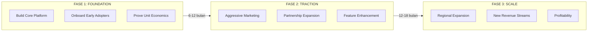

### Growth Hacking Strategies

#### A. Viral Loop - Referral System
```
User A books trip → Gets referral code → 
Shares to friends → Friend B signs up → 
Both get discount → Friend B books → 
Gets referral code → Repeat
```

#### B. Content Marketing
- Blog artikel tentang hidden gems Sulsel
- Video YouTube "Explore Sulsel" series
- TikTok challenges (#JelajahSulsel)
- Kolaborasi dengan travel influencer

#### C. Community Building
- Ambassador program di setiap kabupaten
- Meetup komunitas traveler
- Contest foto/video berhadiah
- Leaderboard top contributors

#### D. Strategic Partnerships
- Kolaborasi dengan maskapai (Garuda, Lion)
- Kerjasama dengan hotel chains
- Partnership dengan kampus (educational tourism)
- Integrasi dengan bank lokal (Bank Sulselbar)

### Key Metrics untuk Growth (North Star Metrics)

| Fase | North Star Metric | Target |
|------|-------------------|--------|
| Foundation | **Monthly Active Users (MAU)** | 10,000 |
| Traction | **Gross Merchandise Value (GMV)** | Rp 500 juta/bulan |
| Scale | **Net Revenue** | Rp 200 juta/bulan |

### Subsidi & Incentive Strategy (ala Gojek)

| Target | Incentive | Periode |
|--------|-----------|---------|
| Wisatawan baru | Diskon 50% booking pertama | 6 bulan pertama |
| UMKM baru | Zero commission 3 bulan | 6 bulan pertama |
| Guide baru | Bonus Rp 500k setelah 10 trip | 1 tahun pertama |
| Referral | Cashback Rp 50k per referral sukses | Ongoing |

> **Catatan:** Budget subsidi perlu disiapkan dari alokasi Pemprov Sulsel untuk akselerasi pertumbuhan awal.

---

## 9. Roadmap Pengembangan

### Fase 1: Foundation (Q1-Q2 2026)

**Target:** MVP Launch & Initial Onboarding

| Milestone | Target | Timeline |
|-----------|--------|----------|
| Finalisasi badan usaha | Akta pendirian | Q1 2026 |
| Backend Development | API production-ready | Q1 2026 |
| Payment Integration | 3 payment method | Q1 2026 |
| Onboarding UMKM | 100 UMKM | Q1-Q2 2026 |
| Onboarding Guide | 50 guide | Q1-Q2 2026 |
| Soft Launch | Beta testing | Q2 2026 |
| Grand Launch | Public release | Q2 2026 |

### Fase 2: Growth (Q3-Q4 2026)

**Target:** User Acquisition & Feature Expansion

| Milestone | Target | Timeline |
|-----------|--------|----------|
| Mobile App (Android) | Play Store launch | Q3 2026 |
| Mobile App (iOS) | App Store launch | Q3 2026 |
| 10,000 Downloads | User acquisition | Q3 2026 |
| Partnership Akomodasi | 50 hotel/resort | Q3-Q4 2026 |
| Event Integration | 20 event | Q4 2026 |
| Marketing Campaign | 5 campaign | Q3-Q4 2026 |

### Fase 3: Scale (2027)

**Target:** Market Leadership & Innovation

| Milestone | Target | Timeline |
|-----------|--------|----------|
| 50,000 Monthly Active Users | User growth | Q1 2027 |
| AI Recommendation | Personalisasi | Q2 2027 |
| Virtual Tour Feature | VR/360 content | Q2 2027 |
| Ekspansi Sulawesi | Sulbar, Sultra | Q3 2027 |
| International Market | ASEAN tourists | Q4 2027 |

### Gantt Chart Overview

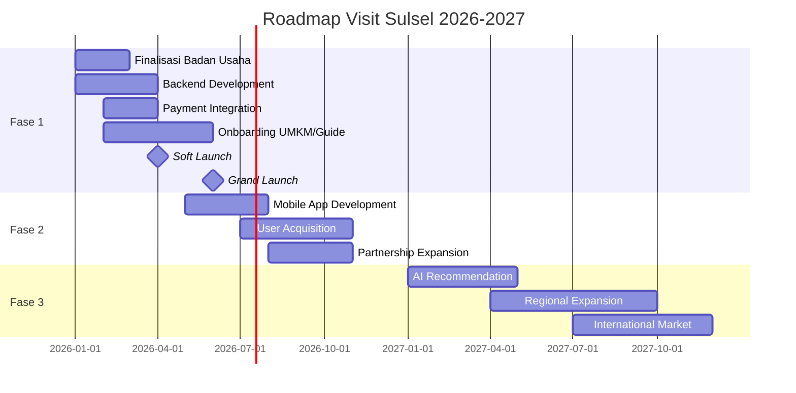

---

## 10. Kebutuhan Investasi dan Pendanaan

### Sumber Pendanaan Awal: Pemerintah Provinsi Sulawesi Selatan

> **PENTING:** Pendanaan awal (initial capital) untuk Visit Sulsel akan di-supply oleh **Pemerintah Provinsi Sulawesi Selatan** melalui mekanisme APBD atau penyertaan modal.

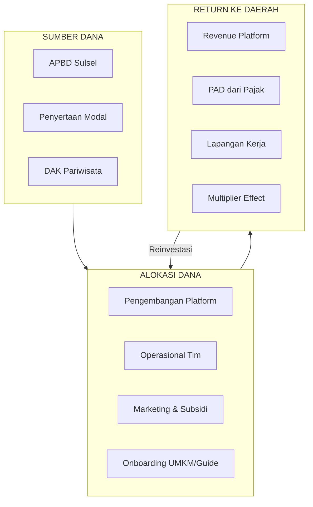

### Skema Pendanaan dari Pemprov

| Tahap | Kebutuhan Dana | Sumber | Mekanisme |
|-------|---------------|--------|-----------|
| **Tahap 1** (Persiapan) | Rp 500 juta | APBD 2026 | Hibah/Bantuan |
| **Tahap 2** (Pembentukan) | Rp 2 miliar | Penyertaan Modal | Perda BUMD |
| **Tahap 3** (Operasional) | Rp 2 miliar | APBD / Revenue | Campuran |
| **Total Tahun 1** | **Rp 4.5 miliar** | Pemprov Sulsel | - |

### Keuntungan Pendanaan dari Pemprov

1. **Legitimasi & Kepercayaan** - Platform resmi pemerintah lebih dipercaya masyarakat
2. **Akses Data** - Integrasi dengan data kependudukan, perizinan UMKM
3. **Network Effect** - Dukungan dari seluruh SKPD dan kabupaten/kota
4. **Sustainability** - Tidak tergantung investor yang fokus exit
5. **Revenue untuk PAD** - Keuntungan kembali ke kas daerah

### Proyeksi Return on Investment untuk Pemprov

| Tahun | Investasi Kumulatif | Revenue | PAD (Dividen + Pajak) | ROI |
|-------|--------------------|---------|-----------------------|-----|
| 1 | Rp 4.5 miliar | Rp 2.5 miliar | Rp 550 juta | -88% |
| 2 | Rp 11 miliar | Rp 5 miliar | Rp 1.25 miliar | -89% |
| 3 | Rp 20 miliar | Rp 8.5 miliar | Rp 2.05 miliar | -90% |
| 4 | Rp 25 miliar | Rp 15 miliar | Rp 4 miliar | -84% |
| 5 | Rp 28 miliar | Rp 25 miliar | Rp 7 miliar | -75% |
| **Break-even** | - | - | - | **Tahun 6-7** |

> **Catatan:** ROI finansial bukan satu-satunya ukuran. Dampak sosial-ekonomi (lapangan kerja, pemberdayaan UMKM, pelestarian budaya) juga harus dihitung sebagai return.

---

### A. Investasi Teknologi

| Komponen | Tahun 1 | Tahun 2 | Tahun 3 |
|----------|---------|---------|---------|
| Backend Development | Rp 500 juta | Rp 200 juta | Rp 150 juta |
| Mobile App | Rp 400 juta | Rp 150 juta | Rp 100 juta |
| Infrastructure (Cloud) | Rp 200 juta | Rp 300 juta | Rp 400 juta |
| Security & Compliance | Rp 100 juta | Rp 100 juta | Rp 100 juta |
| Maintenance | Rp 100 juta | Rp 150 juta | Rp 200 juta |
| **Subtotal** | **Rp 1.3 miliar** | **Rp 900 juta** | **Rp 950 juta** |

### B. Biaya Operasional

| Komponen | Tahun 1 | Tahun 2 | Tahun 3 |
|----------|---------|---------|---------|
| Gaji Tim (15-50 orang) | Rp 1.8 miliar | Rp 3.6 miliar | Rp 6 miliar |
| Kantor & Utilities | Rp 200 juta | Rp 300 juta | Rp 400 juta |
| Legal & Compliance | Rp 150 juta | Rp 100 juta | Rp 100 juta |
| **Subtotal** | **Rp 2.15 miliar** | **Rp 4 miliar** | **Rp 6.5 miliar** |

### C. Marketing & Acquisition

| Komponen | Tahun 1 | Tahun 2 | Tahun 3 |
|----------|---------|---------|---------|
| Digital Marketing | Rp 500 juta | Rp 800 juta | Rp 1 miliar |
| Event & Activation | Rp 300 juta | Rp 500 juta | Rp 600 juta |
| Partnership | Rp 200 juta | Rp 300 juta | Rp 400 juta |
| **Subtotal** | **Rp 1 miliar** | **Rp 1.6 miliar** | **Rp 2 miliar** |

### D. Total Kebutuhan Investasi

| Tahun | Total Investasi | Kumulatif |
|-------|----------------|-----------|
| **Tahun 1** | **Rp 4.45 miliar** | Rp 4.45 miliar |
| **Tahun 2** | **Rp 6.5 miliar** | Rp 10.95 miliar |
| **Tahun 3** | **Rp 9.45 miliar** | Rp 20.4 miliar |

### E. Proyeksi Break-Even

```
Revenue vs Cost (dalam Miliar Rupiah)

     │
 10  │                              ╱ Revenue
     │                          ╱
  8  │                      ╱
     │                  ╱
  6  │              ╱───────────── Cost
     │          ╱
  4  │      ╱
     │  ╱
  2  │╱ ● Break-even Point
     │   (Q3 2027)
  0  └────────────────────────────────
     2026-Q1  Q2  Q3  Q4  2027-Q1  Q2  Q3  Q4
```

**Proyeksi Break-Even: Q3 2027** (±18 bulan setelah launch)

---

## 11. Tim dan Kebutuhan SDM

> **KRITIS:** Visit Sulsel membutuhkan **BANYAK TENAGA KERJA (MANPOWER)** untuk dapat berjalan dengan baik. Ini bukan platform yang bisa dijalankan dengan tim kecil. Seperti Gojek dan Aruna, keberhasilan platform ini sangat bergantung pada kekuatan tim di lapangan.

### Mengapa Butuh Banyak SDM?

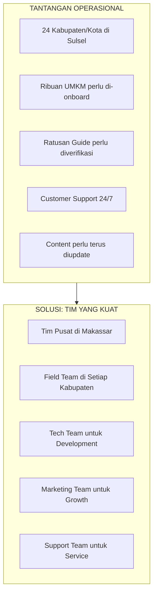

### Struktur Organisasi yang Diusulkan

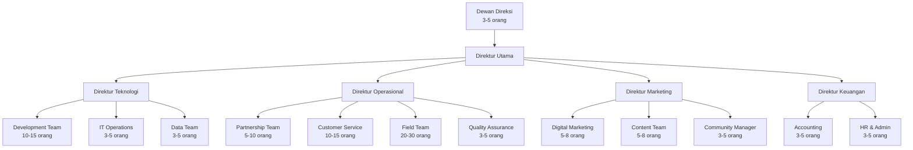

### Kebutuhan SDM Detail per Divisi

#### A. Divisi Teknologi (15-25 orang)

| Posisi | Jumlah | Kualifikasi | Gaji/Bulan | Status |
|--------|--------|-------------|------------|--------|
| CTO / Direktur Teknologi | 1 | Min. 7 tahun di tech startup | Rp 35-50 juta | Dibutuhkan |
| Tech Lead | 2 | Min. 5 tahun, arsitektur sistem | Rp 25-35 juta | Dibutuhkan |
| Senior Full-stack Developer | 4 | Next.js, Node.js, PostgreSQL | Rp 18-25 juta | 1 tersedia |
| Junior Developer | 4 | Fresh graduate, cepat belajar | Rp 8-12 juta | Dibutuhkan |
| Mobile Developer | 3 | React Native / Flutter | Rp 15-22 juta | Dibutuhkan |
| UI/UX Designer | 3 | Figma, user research | Rp 12-18 juta | Dibutuhkan |
| DevOps Engineer | 2 | AWS/GCP, Docker, CI/CD | Rp 18-25 juta | Dibutuhkan |
| QA Engineer | 2 | Testing, automation | Rp 10-15 juta | Dibutuhkan |
| Data Analyst | 2 | SQL, Python, visualization | Rp 12-18 juta | Dibutuhkan |
| IT Support | 2 | Helpdesk, troubleshooting | Rp 6-10 juta | Dibutuhkan |

#### B. Divisi Operasional (35-50 orang)

| Posisi | Jumlah | Kualifikasi | Gaji/Bulan | Status |
|--------|--------|-------------|------------|--------|
| COO / Direktur Operasional | 1 | Pengalaman hospitality/tourism | Rp 30-45 juta | Dibutuhkan |
| Partnership Manager | 3 | Networking, negosiasi | Rp 12-18 juta | Dibutuhkan |
| UMKM Onboarding Specialist | 5 | Pendampingan UMKM | Rp 6-10 juta | Dibutuhkan |
| Guide Verification Officer | 3 | Background check, sertifikasi | Rp 8-12 juta | Dibutuhkan |
| **Field Coordinator (per region)** | 6 | Koordinasi lapangan | Rp 8-12 juta | Dibutuhkan |
| **Field Officer** | 18 | Onboarding, support lapangan | Rp 5-8 juta | Dibutuhkan |
| Customer Service Lead | 2 | Manajemen tim CS | Rp 10-15 juta | Dibutuhkan |
| Customer Service Agent | 12 | Bahasa daerah, English | Rp 4-7 juta | Dibutuhkan |
| Quality Assurance | 3 | Kontrol kualitas layanan | Rp 8-12 juta | Dibutuhkan |

#### C. Divisi Marketing (15-20 orang)

| Posisi | Jumlah | Kualifikasi | Gaji/Bulan | Status |
|--------|--------|-------------|------------|--------|
| CMO / Direktur Marketing | 1 | Digital marketing expertise | Rp 30-45 juta | Dibutuhkan |
| Digital Marketing Manager | 2 | SEO, SEM, Social Media | Rp 15-22 juta | Dibutuhkan |
| Social Media Specialist | 3 | Content, engagement | Rp 8-12 juta | Dibutuhkan |
| Content Writer | 3 | Copywriting, artikel | Rp 6-10 juta | Dibutuhkan |
| Videographer | 2 | Shooting, editing | Rp 8-12 juta | Dibutuhkan |
| Photographer | 2 | Product, destination | Rp 8-12 juta | Dibutuhkan |
| Graphic Designer | 2 | Visual content | Rp 8-12 juta | Dibutuhkan |
| Community Manager | 3 | Forum, ambassador | Rp 8-12 juta | Dibutuhkan |
| PR & Communication | 2 | Media relation | Rp 10-15 juta | Dibutuhkan |

#### D. Divisi Finance & HR (10-15 orang)

| Posisi | Jumlah | Kualifikasi | Gaji/Bulan | Status |
|--------|--------|-------------|------------|--------|
| CFO / Direktur Keuangan | 1 | CPA, pengalaman BUMD | Rp 30-40 juta | Dibutuhkan |
| Finance Manager | 1 | Akuntansi, reporting | Rp 15-20 juta | Dibutuhkan |
| Accountant | 3 | Pembukuan, pajak | Rp 8-12 juta | Dibutuhkan |
| HR Manager | 1 | Rekrutmen, people ops | Rp 15-20 juta | Dibutuhkan |
| HR Staff | 2 | Admin HR, payroll | Rp 6-10 juta | Dibutuhkan |
| Admin & GA | 3 | Office management | Rp 5-8 juta | Dibutuhkan |
| Legal Officer | 1 | Kontrak, compliance | Rp 12-18 juta | Dibutuhkan |

### Total Kebutuhan SDM per Fase

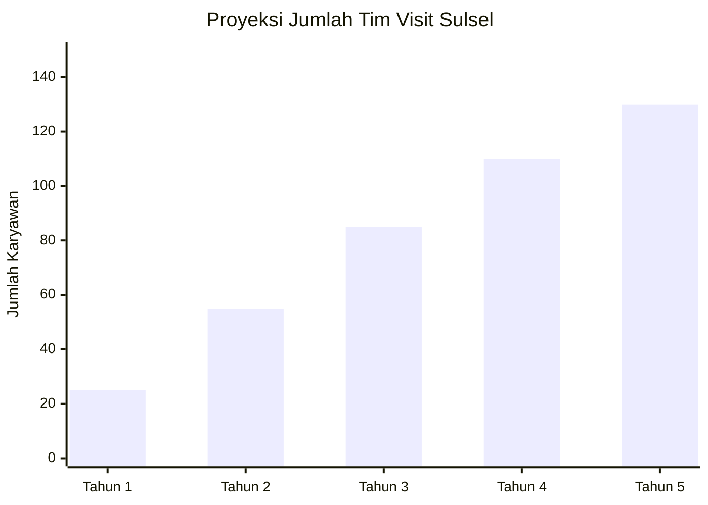

| Fase | Jumlah Tim | Fokus Rekrutmen |
|------|------------|-----------------|
| **Q1-Q2 2026** | 20-25 orang | Core team (tech, ops lead, marketing lead) |
| **Q3-Q4 2026** | 40-55 orang | Field team, CS, content |
| **2027** | 70-85 orang | Scale team, regional expansion |
| **2028** | 100-110 orang | Full operation |
| **2029+** | 120-130 orang | Optimization |

### Strategi Rekrutmen

#### 1. Sumber Talent

| Sumber | Target | Strategi |
|--------|--------|----------|
| **Universitas Sulsel** | Fresh graduate tech & business | Career fair, internship program |
| **Diaspora Sulsel** | Talent dari Jakarta/luar daerah | Return home program, remote option |
| **Profesional Lokal** | Mid-level experienced | LinkedIn, referral |
| **OJK/Fintech Alumni** | Expertise digital finance | Networking |
| **Tourism Industry** | Hospitality background | Industry event |

#### 2. Program Pengembangan SDM

| Program | Deskripsi | Budget/Tahun |
|---------|-----------|--------------|
| **Bootcamp Tech** | Pelatihan intensif developer lokal | Rp 200 juta |
| **UMKM Academy** | Training untuk onboarding specialist | Rp 100 juta |
| **Leadership Program** | Pengembangan middle management | Rp 150 juta |
| **Sertifikasi** | Sertifikasi profesional untuk tim | Rp 100 juta |

### Field Team: Kunci Sukses Operasional

> **Pelajaran dari Gojek & Aruna:** Field team yang kuat adalah kunci sukses. Mereka adalah "kaki" platform di lapangan.

#### Pembagian Wilayah Field Team

| Region | Kabupaten/Kota | Field Coordinator | Field Officer |
|--------|----------------|-------------------|---------------|
| **Makassar Raya** | Makassar, Maros, Gowa, Takalar | 1 | 4 |
| **Toraja** | Toraja, Toraja Utara, Enrekang | 1 | 3 |
| **Pantai Selatan** | Bulukumba, Selayar, Bantaeng, Jeneponto | 1 | 4 |
| **Bone Raya** | Bone, Wajo, Soppeng, Sinjai | 1 | 3 |
| **Luwu Raya** | Palopo, Luwu, Luwu Utara, Luwu Timur | 1 | 2 |
| **Sulsel Barat** | Pinrang, Sidrap, Barru, Pangkep, Pare-pare | 1 | 2 |
| **Total** | 24 Kab/Kota | **6** | **18** |

#### Tugas Field Team

1. **Onboarding UMKM** - Registrasi, foto produk, training penggunaan platform
2. **Verifikasi Guide** - Cek sertifikasi, interview, background check
3. **Quality Control** - Monitoring kualitas layanan mitra
4. **Problem Solving** - Handle komplain dan masalah di lapangan
5. **Community Building** - Event lokal, meetup dengan mitra
6. **Data Collection** - Update informasi destinasi, harga, ketersediaan

### Estimasi Biaya SDM

| Tahun | Jumlah Tim | Rata-rata Gaji | Total Gaji/Tahun | Overhead (30%) | Total Biaya SDM |
|-------|------------|----------------|------------------|----------------|-----------------|
| 1 | 25 | Rp 10 juta | Rp 3 miliar | Rp 900 juta | **Rp 3.9 miliar** |
| 2 | 55 | Rp 11 juta | Rp 7.26 miliar | Rp 2.18 miliar | **Rp 9.44 miliar** |
| 3 | 85 | Rp 12 juta | Rp 12.24 miliar | Rp 3.67 miliar | **Rp 15.91 miliar** |

> **Catatan:** Biaya SDM adalah komponen terbesar (60-70% dari total operasional). Ini adalah investasi untuk memastikan platform berjalan dengan baik.

---

## 12. Analisis Risiko dan Mitigasi

### A. Risiko Adopsi User

| Risiko | Level | Mitigasi |
|--------|-------|----------|
| User tidak aware platform | Tinggi | Kampanye marketing masif, kerjasama influencer |
| User prefer platform lain (Traveloka, dll) | Sedang | Diferensiasi dengan fitur lokal, harga kompetitif |
| UMKM enggan onboard | Sedang | Gratis pendaftaran, pelatihan, pendampingan |

### B. Risiko Teknologi

| Risiko | Level | Mitigasi |
|--------|-------|----------|
| Downtime / server crash | Sedang | Cloud infrastructure, backup, monitoring 24/7 |
| Security breach | Tinggi | Audit keamanan, enkripsi, compliance |
| Skalabilitas | Sedang | Arsitektur microservices, auto-scaling |

### C. Risiko Bisnis

| Risiko | Level | Mitigasi |
|--------|-------|----------|
| Cash flow negatif | Tinggi | Diversifikasi revenue, efisiensi biaya |
| Kompetisi dari platform nasional | Sedang | Fokus lokal, partnership eksklusif |
| Perubahan regulasi | Rendah | Legal compliance, lobbying |

### D. Risiko Operasional

| Risiko | Level | Mitigasi |
|--------|-------|----------|
| Kualitas produk/layanan UMKM tidak konsisten | Sedang | Kurasi, rating system, quality control |
| Keluhan pelanggan | Sedang | Tim CS responsif, SLA jelas |
| Fraud / penipuan | Sedang | Verifikasi seller, payment protection |

### Matriks Risiko

```
            DAMPAK
          Low    Med    High
       ┌───────┬───────┬───────┐
  Low  │       │       │       │
       ├───────┼───────┼───────┤
PROB   │Regulasi│Kompetisi│      │
  Med  │       │Skalabil│Cash   │
       ├───────┼───────┼───────┤
 High  │       │UMKM   │Security│
       │       │Adopsi │User    │
       └───────┴───────┴───────┘
```

---

## 13. Lampiran

### A. Screenshot Platform

Platform Visit Sulsel sudah dalam tahap development dengan fitur-fitur utama:

1. **Homepage** - Hero section dengan quick links
2. **Destinasi** - Gallery dengan filter kategori
3. **Marketplace UMKM** - Katalog produk dengan shopping cart
4. **Creator Hub** - Profil kreator dengan portfolio
5. **Tour Guide** - Daftar guide dengan booking
6. **Komunitas** - Forum diskusi dan review

### B. Tech Stack Detail

```
┌─────────────────────────────────────────────────────────┐
│                    FRONTEND                             │
├─────────────────────────────────────────────────────────┤
│  Next.js 16.1.1  │  React 19.2.3  │  TypeScript 5      │
│  Tailwind CSS 4  │  Framer Motion │  Leaflet (Maps)    │
└─────────────────────────────────────────────────────────┘
                            │
                            ▼
┌─────────────────────────────────────────────────────────┐
│                    BACKEND (Planned)                    │
├─────────────────────────────────────────────────────────┤
│  Node.js / Go    │  PostgreSQL    │  Redis Cache       │
│  REST API        │  GraphQL       │  Message Queue     │
└─────────────────────────────────────────────────────────┘
                            │
                            ▼
┌─────────────────────────────────────────────────────────┐
│                    INFRASTRUCTURE                       │
├─────────────────────────────────────────────────────────┤
│  Docker          │  Kubernetes    │  Cloud (AWS/GCP)   │
│  CI/CD           │  Monitoring    │  CDN               │
└─────────────────────────────────────────────────────────┘
```

### C. Daftar Destinasi Lengkap

| No | Nama | Lokasi | Kategori | HTM |
|----|------|--------|----------|-----|
| 1 | Tana Toraja | Kab. Toraja | Budaya | Gratis - Rp50.000 |
| 2 | Pantai Losari | Makassar | Pantai | Gratis |
| 3 | TN Bantimurung | Maros | Alam | Rp30.000 |
| 4 | Pulau Samalona | Spermonde | Pantai | Rp150.000 (boat) |
| 5 | Malino Highland | Gowa | Alam | Gratis |
| 6 | Rammang-Rammang | Maros | Alam | Rp50.000 |
| 7 | Fort Rotterdam | Makassar | Budaya | Rp10.000 |
| 8 | Pantai Bira | Bulukumba | Pantai | Rp20.000 |

### D. Daftar Event & Festival

| Event | Tanggal | Lokasi | Kategori |
|-------|---------|--------|----------|
| Makassar Writers Festival | 10-14 Mei 2026 | Makassar | Seni |
| Festival Budaya Luwu | 20-25 Jul 2026 | Palopo | Festival |
| Rambu Solo' Season | Jul-Sep 2026 | Toraja | Budaya |
| F8 Makassar | 8-10 Agt 2026 | Makassar | Musik |
| Festival Pinisi | 15-20 Sep 2026 | Bulukumba | Festival |
| Lovely December | Des 2026 | Toraja | Festival |

### E. Kontak dan Informasi

**Tim Visit Sulsel**
- Email: [akan ditentukan]
- Website: visitsulsel.com
- Repository: [internal]

---

## Penutup

Visit Sulsel bukan sekadar platform digital - ini adalah **gerakan ekonomi** yang bertujuan memberdayakan masyarakat Sulawesi Selatan melalui pariwisata. Dengan dukungan Pemerintah Provinsi dan kolaborasi dengan berbagai stakeholder, Visit Sulsel berpotensi menjadi model **BUMD Digital** pertama di sektor pariwisata Indonesia Timur.

Kami mengundang Dinas Pariwisata dan seluruh pemangku kepentingan untuk bersama-sama mewujudkan visi ini.

---

*Dokumen ini disiapkan untuk meeting koordinasi dengan Dinas Pariwisata Provinsi Sulawesi Selatan.*

**Visit Sulsel - Jelajahi, Pesan, Belanja - Satu Platform**

*© 2026 Visit Sulsel*
