# Diagram Visual - Visit Sulsel

Dokumen ini berisi diagram-diagram visual untuk presentasi business plan Visit Sulsel.

---

## 0. Tahapan Pendekatan ke Gubernur

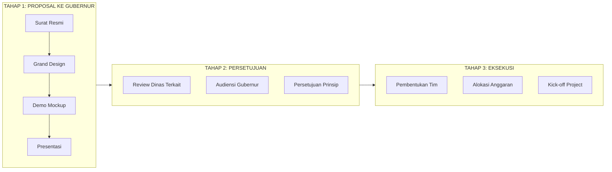

---

## 1. Ekosistem Platform Visit Sulsel

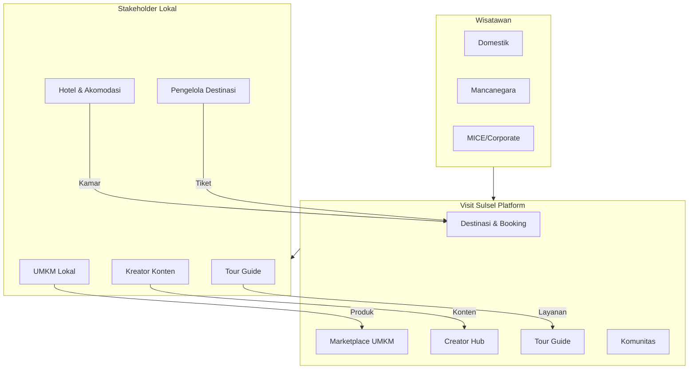

---

## 2. Alur Bisnis dan Revenue

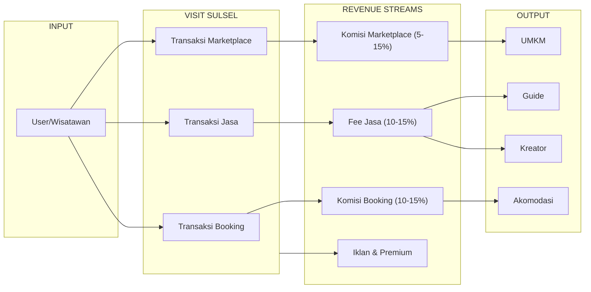

---

## 3. Model Bisnis Canvas

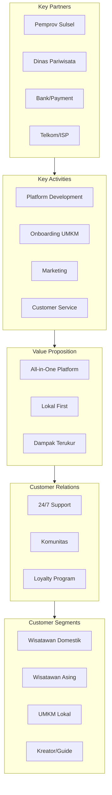

---

## 4. User Journey - Wisatawan

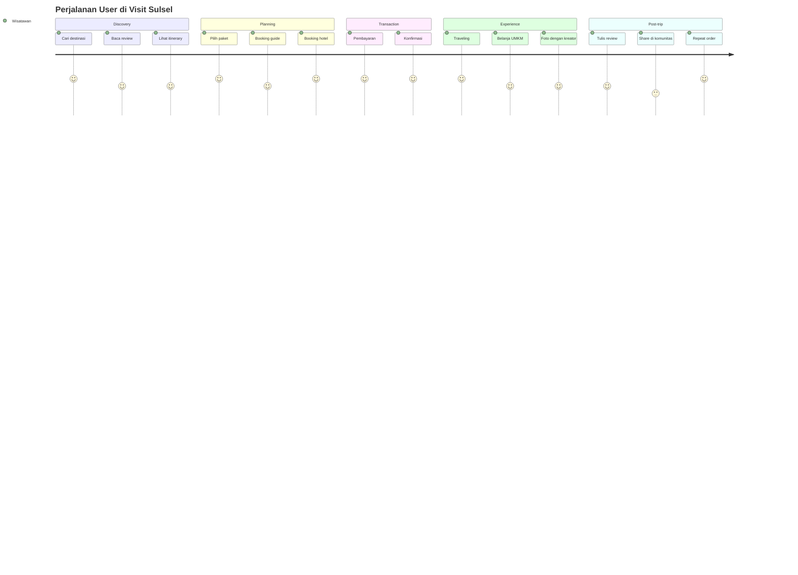

---

## 5. Arsitektur Teknis Platform

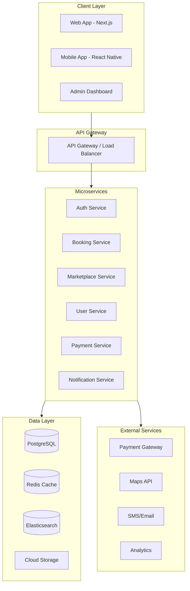

---

## 6. Roadmap Timeline

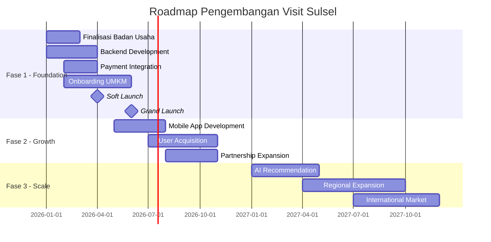

---

## 7. Struktur Organisasi

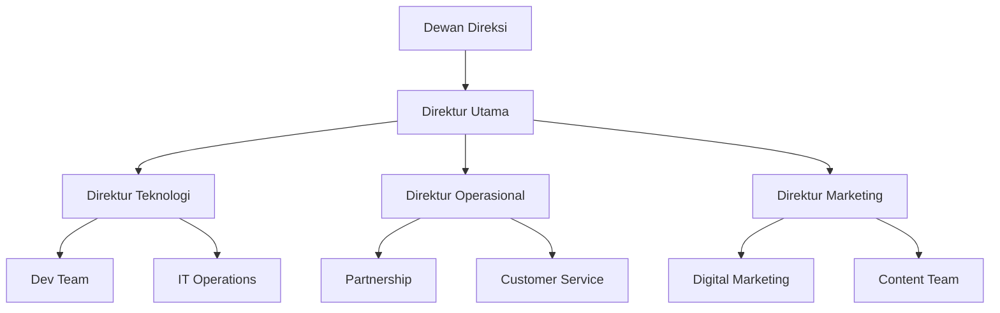

---

## 8. Perbandingan Model Badan Usaha

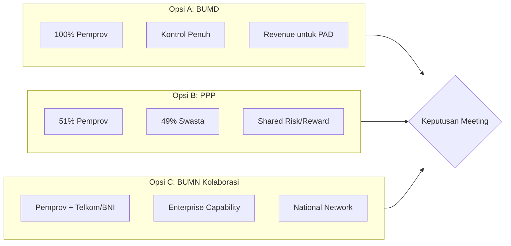

---

## 9. Proyeksi Keuangan

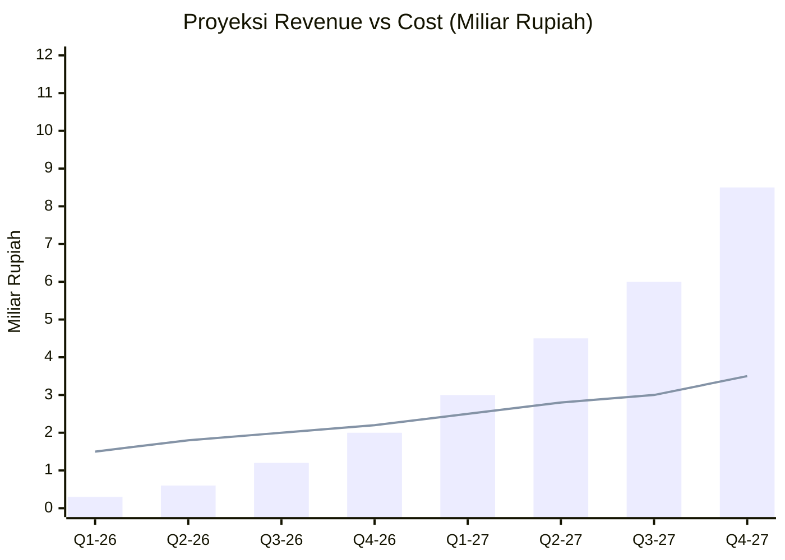

---

## 10. Dampak Ekonomi

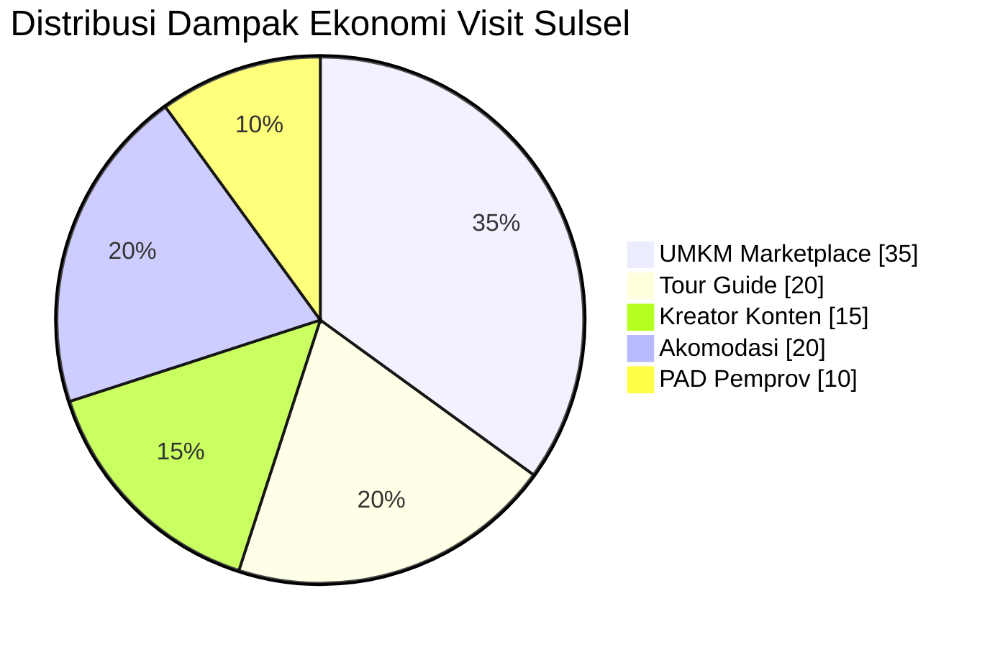

---

## 11. Matriks Stakeholder

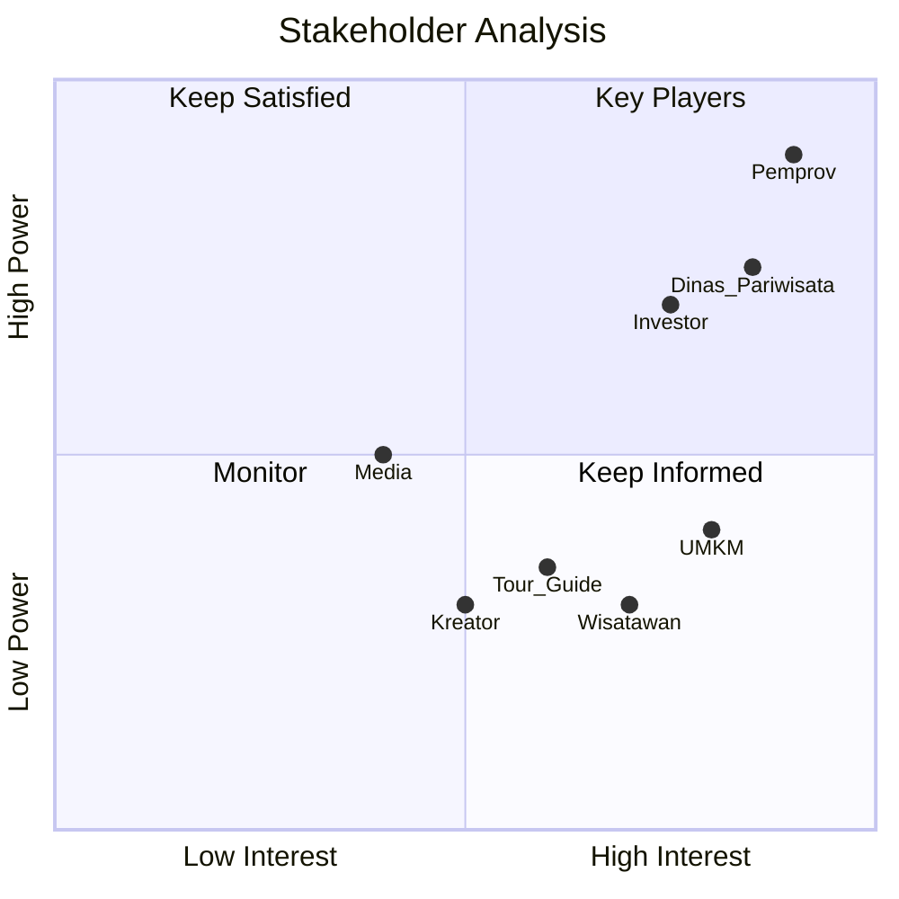

---

## 12. Analisis SWOT

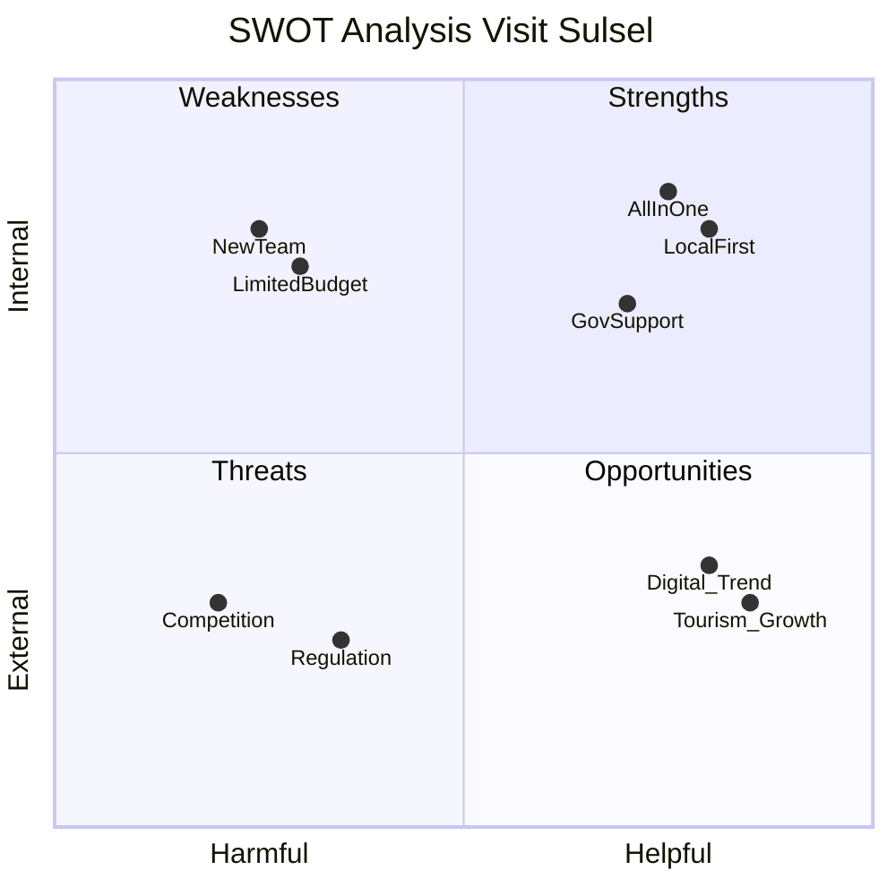

---

## 13. Strategi Pertumbuhan ala Startup Sukses

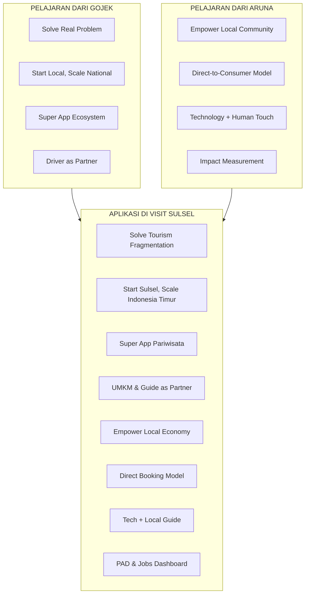

---

## 14. Skema Pendanaan dari Pemprov

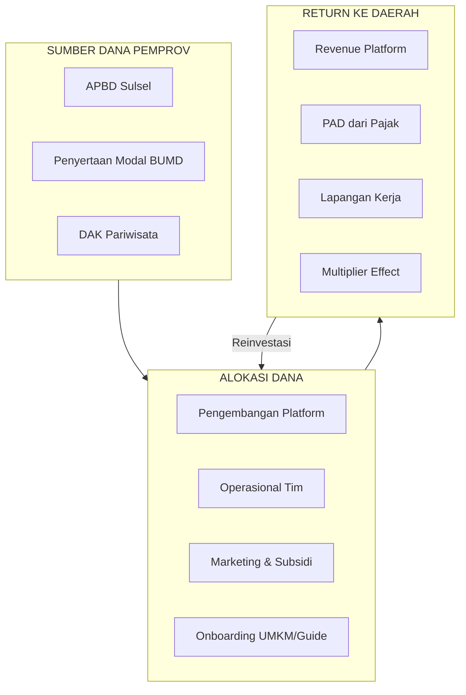

---

## 15. Struktur Tim dan Field Team

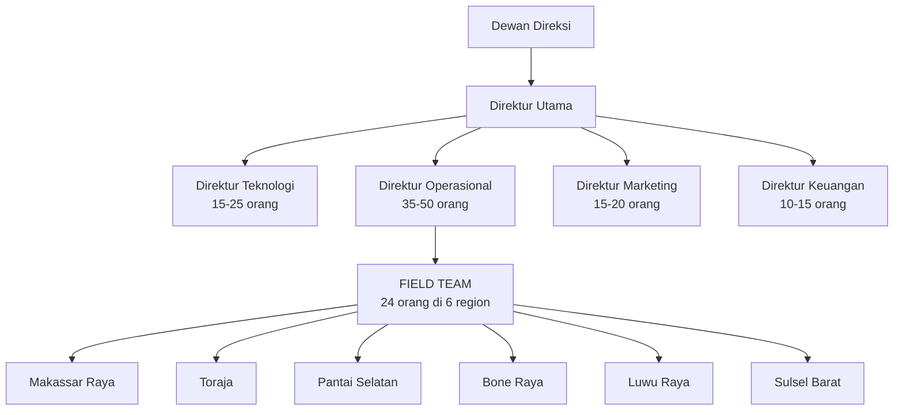

---

## 16. Proyeksi Pertumbuhan Tim

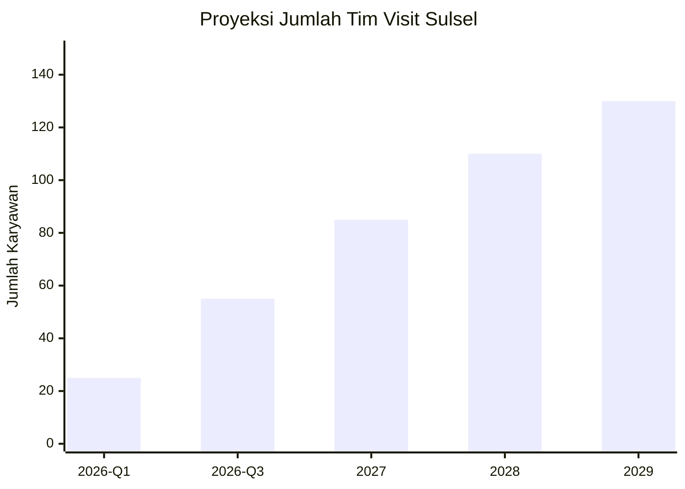

---

## 17. Fase Pertumbuhan Platform

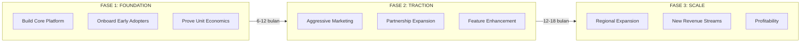

---

## Cara Menggunakan Diagram

### Untuk Presentasi
1. Copy kode mermaid ke [Mermaid Live Editor](https://mermaid.live)
2. Export sebagai PNG/SVG
3. Masukkan ke slide presentasi

### Untuk Dokumentasi
- Diagram dapat di-render langsung di GitHub, GitLab, atau Notion
- Gunakan plugin Mermaid di editor markdown

### Tools Rendering
- **Online**: mermaid.live, github.com
- **VS Code**: Markdown Preview Mermaid Support
- **Notion**: Built-in support
- **Confluence**: Mermaid plugin

---

*Diagram dibuat untuk mendukung Business Plan Visit Sulsel*
