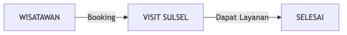
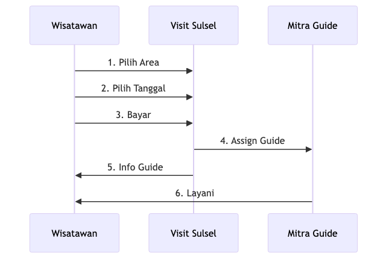
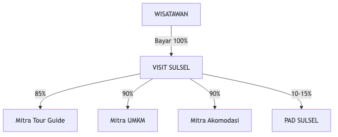

# Slide Baru: Model Bisnis Kemitraan

**MODEL KEMITRAAN VISIT SULSEL**

*Terinspirasi dari JakLingko Jakarta*

---

## 1. ALUR LAYANAN - Yang Dilihat Wisatawan

> Wisatawan hanya tahu booking dari **PEMERINTAH**

---

## 2. ALUR LAYANAN - Di Belakang Layar

> Mitra melayani atas nama **PEMERINTAH**

---

## 3. DETAIL BOOKING TOUR GUIDE

**Poin Penting:**
- Wisatawan TIDAK pilih guide individual
- Info guide muncul SETELAH pembayaran

---

## 4. EKOSISTEM REVENUE

| Penerima | Persentase |
|----------|------------|
| Mitra Tour Guide | 85% |
| Mitra UMKM | 90% |
| Mitra Akomodasi | 90% |
| **PAD Sul-Sel** | **10-15%** |

---

*Dokumen untuk Tim Designer - Visit Sulsel*
